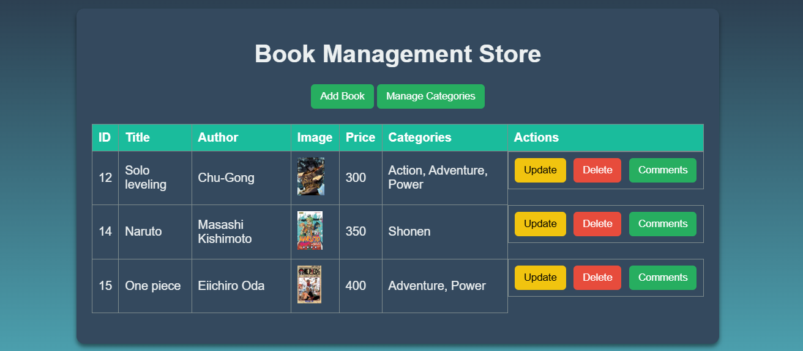

# Book Management Web Application
This Spring Boot project is a simple web application designed for managing books. It implements a RESTful API with CRUD (Create, Read, Update, Delete) functionalities for managing book records.

 <!-- Replace with a relevant image of your choice -->

## Features
- Add, update, and delete books.
- View book records via a RESTful API.
- Supports multiple database configurations (H2 and MySQL).

## Dependencies
The following dependencies are used in this project:
- **Spring Web**
- **Spring Boot DevTools**
- **MySQL Driver**
- **H2 Database**
- **Spring Data JPA**

## How to Run the Application

### Step 1: Clone the Repository
Clone the project repository to your local machine:
```bash
git clone <repository-url>
```

### Step 2: Configure Spring Profiles
Two Spring profiles are implemented: `h2` and `mysql`. Create specific property files for each profile in the `src/main/resources` directory:
- **application-h2.properties**: Configures the application to use the H2 database.
- **application-mysql.properties**: Configures the application to use MySQL.

#### H2 Database
The H2 database is a lightweight, in-memory relational database. Data is stored temporarily and will be lost after the application stops. To interact with the H2 database:
1. Start the application.
2. Navigate to `http://localhost:8080/h2-console`.
3. Log in with the JDBC URL specified in the `application-h2.properties` file.

#### MySQL Database
For persistent data storage, configure the `application-mysql.properties` file with your MySQL server settings. Ensure you have a MySQL server running and a schema created.

### Step 3: Activate a Profile
There are multiple ways to activate a profile:
1. **In application.properties**: Add the following line to select the desired profile:
   ```properties
   spring.profiles.active=h2
   ```

2. **Using Maven**:
   ```bash
   mvn spring-boot:run -Dspring-boot.run.arguments="--spring.profiles.active=mysql"
   ```

3. **Using Java**:
   ```bash
   java -jar target/your-application.jar --spring.profiles.active=mysql
   ```

4. **In an IDE (e.g., IntelliJ or Eclipse)**:
   - Go to Run Configurations or Edit Configurations.
   - Add `--spring.profiles.active=h2` or `--spring.profiles.active=mysql` in the program arguments.

## Testing the API
To test the API, you can access the Swagger UI (dependency added to the project) at:
```
http://localhost:8080/swagger-ui/index.html
```
This interface provides a user-friendly way to explore and test the API endpoints.

Alternatively, you can access the front-end interface to interact with, at:
```
http://localhost:8080/index.html
```
This page, located under `src/main/resources/static/index.html`, allows you to interact with the RESTful API in a more user-friendly manner.